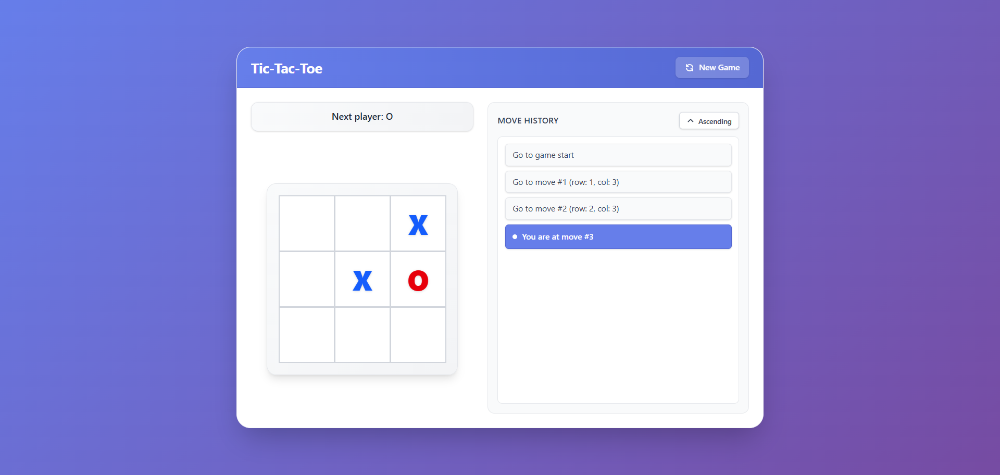

# ⭕ Tic-Tac-Toe Game

**Demo**: https://ia04-react-tutorial.vercel.app/

<p align="center">
  
</p>

## ✨ Tính năng nổi bật

- 🎨 **Giao diện hiện đại, chuyên nghiệp** với gradient background và card-like design
- 📱 **Responsive**: tối ưu cho mobile, tablet và desktop
- 🔄 **Time travel**: xem lại và quay về bất kỳ nước đi nào trong lịch sử
- 📍 **Hiển thị vị trí nước đi**: mỗi nước đi hiển thị tọa độ (row, col) 1-indexed
- 🔢 **Current move indicator**: hiển thị "You are at move #X" thay vì button cho nước đi hiện tại
- 🔀 **Sort moves**: toggle sắp xếp lịch sử nước đi tăng dần/giảm dần
- 🏆 **Highlight winner**: tự động highlight 3 ô thắng với màu xanh lá và hiệu ứng nổi bật
- 🤝 **Draw detection**: hiển thị "Result: Draw" khi hòa
- 🎮 **New Game**: nút reset để bắt đầu ván mới
- ♿ **Accessibility**: ARIA labels, keyboard navigation, focus states rõ ràng
- 🎯 **Board với loops**: board được render động bằng 2 vòng lặp lồng nhau (rows × columns)

---

## 🚀 Hướng dẫn cài đặt

**Yêu cầu:** Node.js >= 18, npm hoặc yarn

```bash
# Clone về máy
git clone https://github.com/MinhNguyenCG/ia04-react-tutorial
cd ia04-react-tutorial

# Cài dependencies
npm install

# Chạy local
npm run dev
```

Mở trình duyệt truy cập `http://localhost:5173`.

### Build production

```bash
npm run build
npm run preview  # Xem build prod
```

---

## ⚡ Cách dùng

- **Click vào ô trống** trên bàn cờ để đánh X hoặc O
- **Click vào nước đi trong lịch sử** để quay về nước đi đó (time travel)
- **Nút "New Game"**: reset game về trạng thái ban đầu
- **Nút "Ascending/Descending"**: đảo ngược thứ tự hiển thị lịch sử nước đi
- **Current move**: nước đi hiện tại được hiển thị dạng text (không phải button) với background màu xanh
- **Winning squares**: 3 ô thắng được highlight màu xanh lá với border và shadow nổi bật
- **Move location**: mỗi nước đi hiển thị vị trí (row: X, col: Y) trong lịch sử

### Luật chơi

- Người chơi X đi trước, sau đó đến O
- Người chơi đầu tiên có 3 ô liên tiếp (ngang, dọc, hoặc chéo) sẽ thắng
- Nếu cả 9 ô đều được điền và không có người thắng → Hòa

---

## 🏗️ Kiến trúc dự án

```
src/
├── App.tsx                  # Component chính, render Game
├── Game.tsx                 # Component quản lý game state, history, sort
├── Board.tsx                # Component bàn cờ 3x3, render với loops
├── Square.tsx               # Component ô vuông đơn lẻ
├── utils.ts                 # Utility functions (calculateWinner)
├── index.css                # Tailwind CSS, custom styles, scrollbar
└── main.tsx                 # Entry point, khởi tạo React app
```

---

## 🔑 Công nghệ chính

- **React 19** + **TypeScript 5.9**
- **Vite 7** (build tool & dev server)
- **Tailwind CSS 4** (styling với CSS-based configuration)
- **PostCSS** + **Autoprefixer** (CSS processing)
- **ESLint 9** (code quality)
- **@vitejs/plugin-react-swc** (React Fast Refresh với SWC)

## 📐 Đặc tả UI / logic nổi bật

### Core Features

1. **Current Move Text**:

   - Nước đi hiện tại hiển thị dạng text "You are at move #X" (hoặc "You are at game start")
   - Background màu xanh primary với white dot indicator
   - Các nước đi khác hiển thị dạng button có thể click

2. **Board với Loops**:

   - Board được render bằng 2 vòng lặp lồng nhau (outer: rows, inner: columns)
   - Không hardcode 9 Square components
   - Tính toán index: `row * 3 + col`

3. **Sort Toggle**:

   - Nút toggle "Ascending/Descending" để đảo ngược thứ tự lịch sử
   - Mặc định: ascending (0 → last)
   - Current move indicator vẫn hoạt động đúng trong cả 2 chế độ

4. **Highlight Winner & Draw**:

   - `calculateWinner` trả về `{ winner: string | null, winningLine: number[] | null }`
   - 3 ô thắng được highlight với:
     - Background màu xanh lá (green-400)
     - Border dày hơn (3px) màu xanh lá đậm
     - Shadow và scale effect
     - Ring effect
   - Hiển thị "Winner: X" hoặc "Winner: O"
   - Hiển thị "Result: Draw" khi bàn cờ đầy và không có người thắng

5. **Move Location**:
   - Mỗi nước đi lưu vị trí `{ row: number, col: number }` (1-indexed)
   - Hiển thị trong lịch sử: "Go to move #X (row: Y, col: Z)"
   - Tính toán: `row = Math.floor(i / 3) + 1`, `col = (i % 3) + 1`

### UI/UX Features

- **Fixed size container**: 900px width, 650px height (desktop), responsive trên mobile
- **Scrollbar cho move history**: custom styled scrollbar khi danh sách dài
- **Responsive design**:
  - Mobile: vertical layout, smaller text và buttons
  - Desktop: horizontal layout (board bên trái, history bên phải)
- **Smooth transitions**: hover effects, active states, scale animations
- **Color coding**:
  - X: màu xanh dương (blue-600)
  - O: màu đỏ (red-600)
  - Winning squares: màu xanh lá (green-400)
- **Status bar**: hiển thị trạng thái game (Next player, Winner, Draw)
- **Accessibility**:
  - ARIA labels cho buttons
  - Keyboard navigation support
  - Focus states rõ ràng
  - Disabled states cho ô đã điền

---

## 🧑‍💻 Đóng góp / phát triển

PR và mọi ý kiến đóng góp đều hoan nghênh!

- Fork, branch, pull-request như standard.

---

**Made with ❤️ using React + TypeScript + Tailwind CSS**
